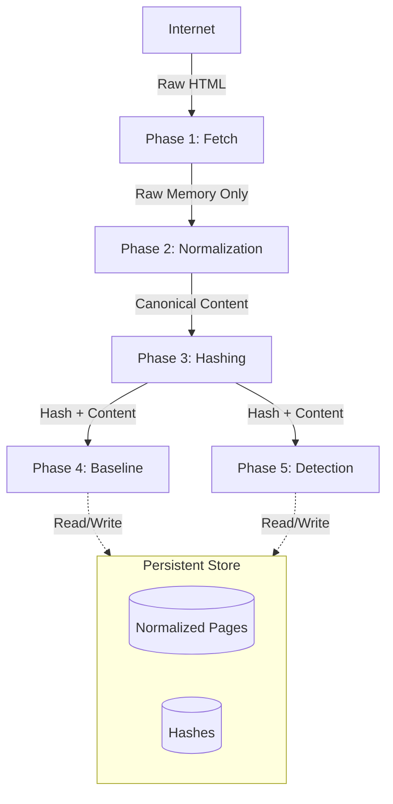

# System Architecture: Normalized-Only Web Crawler

> [!CAUTION]
> **ARCHITECTURAL HARD DEPRECATION**
> Raw HTML, raw DOM bodies, and non-canonical artifacts MUST NOT be stored. 
> All persistence, diffing, and detection logic operates STRICTLY on normalized content.

## 1. System Phases (Ordered)

The pipeline is strictly linear.

1.  **Phase 1: Crawl & Fetch** (Fetch -> Pass)
2.  **Phase 2: Normalization (CRITICAL)** (Raw -> Canonical)
3.  **Phase 3: Hashing** (Canonical -> Hash)
4.  **Phase 4: Baseline Management** (Management of Canonical Truth)
5.  **Phase 5: Detection** (Hash vs Hash comparison)
6.  **Phase 6: Reporting / UI** (Presentation of Normalized Diffs)

---

## 2. Why This Shift? (The "No Raw Storage" Rule)

We have permanently eliminated raw HTML storage for the following reasons:

1.  **DB Cost Explosion**: Raw HTML storage at scale is cost-prohibitive and largely redundant.
2.  **Noise Reduction**: Raw HTML contains dynamic timestamps, session tokens, and ad-server identifiers that trigger false positive defacement alerts.
3.  **Operational Speed**: Diffing normalized content is O(1) with pre-computed hashes; diffing raw HTML is expensive.
4.  **Workflow Alignment**: Our forensic workflow relies on "What changed meaningfully?", not "what byte changed?".

### ⚠️ Important Risks
*   **No Raw Forensics**: We cannot "replay" the exact byte-stream of an attack. We can only show the normalized semantic difference.
*   **Normalization Criticality**: If the normalization logic is flawed, the entire security posture is compromised. Versioning of normalization rules is now a critical system dependency.

---

---

## 3. URL Canonicalization (Invariant)

> **Invariant:** A Canonical URL is the sole identity of a page.
> All crawling, hashing, baseline management, and detection operate exclusively on Canonical URLs.
> Two different Canonical URLs must never represent the same semantic page.

This canonicalization happens **before**:
*   Task insertion
*   Baseline lookup
*   PageVersion persistence
*   Hash computation

### Canonicalization Rules (Exact Order)

**GLOBAL INVARIANTS:**

1.  **Scheme**
    *   Force `https`
    *   Use final resolved URL after redirects
2.  **Host**
    *   Lowercase
    *   Strip leading `www.`
3.  **Trailing Slash (CRITICAL)**
    *   Remove trailing `/` unless path is `/`
    *   `/blog/` → `/blog`
4.  **Query String**
    *   Strip ALL tracking parameters: `utm_*`, `fbclid`, `gclid`, `ref`, `session`, analytics params
    *   Canonical URL must never contain query params
5.  **Fragments**
    *   Remove `#fragment` entirely
6.  **Case**
    *   Lowercase path by default

---

## 4. Data Flow Overview

*   **Ingest**: Raw HTML enters Phase 1.
*   **Transformation**: Converted to Normalized Content in Phase 2.
*   **Discard**: Raw HTML is dropped immediately after Phase 2.
*   **Persistence**: ONLY Normalized Content and Hashes are stored.

---

## 5. Phase Summaries

### Phase 1: Crawl & Fetch
*   **Role**: I/O Worker.
*   **Input**: URL.
*   **Output**: Stream of bytes (Transient).
*   **Storage**: **NONE**.

### Phase 2: Normalization
*   **Role**: The Gatekeeper.
*   **Input**: Raw bytes.
*   **Output**: `PageVersion` (Canonicalized text/structure).
*   **Logic**: Strip scripts, styles, ads, dynamic attributes.
*   **Storage**: **NONE** (Pass-through).

### Phase 3: Hashing
*   **Role**: Fingerprinting.
*   **Input**: `PageVersion`.
*   **Output**: `ContentHash` (SHA-256 or SimHash).
*   **Logic**: Compute deterministic signature of normalized content.

### Phase 4: Baseline Management
*   **Role**: Truth definition.
*   **Input**: `PageVersion` + `ContentHash`.
*   **Logic**: "Is this the new normal?"
*   **Storage**: Writes to `BaselineTable`.

### Phase 5: Detection
*   **Role**: Anomaly spotting.
*   **Input**: Current `ContentHash` vs Baseline `ContentHash`.
*   **Logic**: 
    *   Match? -> Discard Current (Optimization).
    *   Mismatch? -> Flag as `DEFACEMENT` or `CHANGE`.
*   **Storage**: Writes `DetectionEvent` and `PageVersion` (if changed).

### Phase 6: Reporting / UI
*   **Role**: Visualizing change.
*   **Input**: Two `PageVersion` records.
*   **Display**: Computed Diff (Text/Structural).
*   **Constraint**: No raw replay available.

---

## 6. Conceptual Data Model

### Entities

#### `Site`
*   Root domain and policy config.

#### `Page`
*   Represents a unique **Normalized URL**.
*   Does NOT track query params unless meaningful.

#### `PageVersion` (The Core Entity)
*   **Content**: The **NORMALIZED** text/structure.
*   **Hash**: The signature of the content.
*   **Timestamp**: When this version was seen.
*   **Associations**: Linked to Detection Events or Baselines.

### ❌ Removed Entities
*   `RawArtifact`: Deleted.
*   `HtmlBody`: Deleted.

---

## 7. System Invariants

1.  **Normalization Gate**: No content enters the database without passing through Phase 2.
2.  **Hash Trust**: If `Hash(A) == Hash(B)`, then `A` and `B` are virtually identical. We trust the hash.
3.  **One Truth**: There is no "Raw Truth" separate from "Normalized Truth".
4.  **Version Compatibility**: A `PageVersion` is ONLY comparable to another `PageVersion` with the same `normalization_version`. Mixing versions results in undefined behavior (false positives).

## 8. Critical Constraints & Disclaimers

### ⚖️ Operational vs. Legal
**This system is designed for operational integrity monitoring, not legal-grade forensic reconstruction.** 
We explicitly trade bit-perfect raw history for operational speed and cost resilience.

### ⚛️ SPA / Client-Side Rendering
Client-side rendered content is supported **only** when:
1.  Server-side HTML contains the semantic payload (SSR), OR
2.  Headless rendering is explicitly enabled in Phase 1.
Pure client-side apps without headless support will likely yield empty normalized content.

---

## 9. Forward Compatibility: Historical Diff Hooks

**NOTE: DESIGN ONLY - NOT CURRENTLY IMPLEMENTED**

We are **NOT** building historical diff now. We are only **reserving architectural support** so it is not blocked later.

> These hooks enable historical diff in the future without requiring schema redesign.

### Required Hooks to Document

1.  **PageVersion Lineage**
    *   `page_id`
    *   `content_hash`
    *   `normalized_content`
    *   `normalization_version`
    *   `created_at`

2.  **Baseline History**
    *   Baselines reference `page_version_id`
    *   Baselines have `promoted_at`
    *   Old baselines are archived, not overwritten

3.  **Detection Event Linking**
    *   `previous_baseline_version_id`
    *   `current_page_version_id`

### Explicitly Not Required
*   No raw HTML storage
*   No screenshots
*   No DOM replay
*   No visual regression

