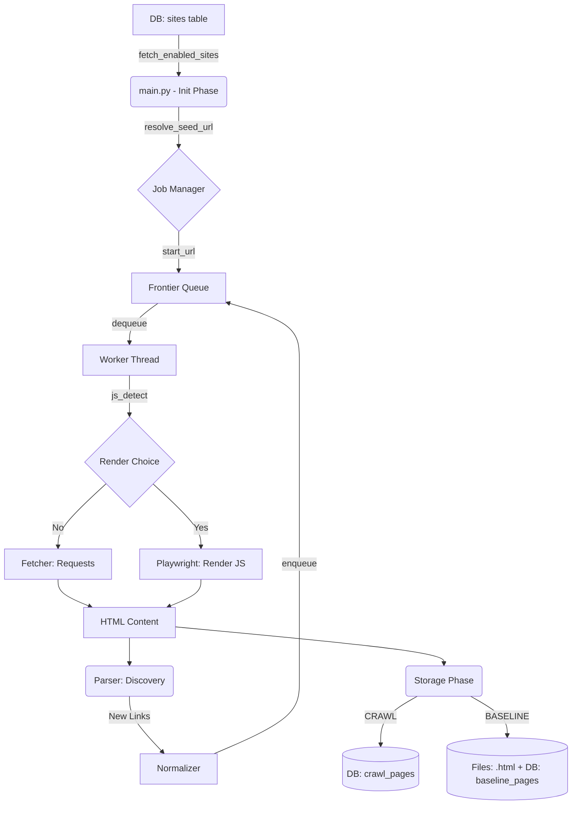

# 🕸️ Enterprise Web Crawler & Defacement Detection

A high-performance, dynamic-scaling web crawler with JavaScript rendering capabilities, designed for site seeding, baseline generation, and semantic defacement detection.

---

## 📐 Deep Dive: The Crawl Life Cycle

A URL in this system travels through several distinct phases. Below is the architectural flow and the data-logic mapping.

### 🔄 The Flowchart


### 🗺️ Functional Phase Mapping

| Phase | Responsibility | Key File / Function | Data Logic |
| :--- | :--- | :--- | :--- |
| **Phase 1: Setup** | Site selection & Filtering | `main.py` -> `main()` | Fetches enabled sites; filters by `--siteid` or `--custid`. |
| **Phase 2: Registry** | Job tracking & Resolving | `main.py` -> `crawl_site()` | Resolves HTTP/HTTPS/WWW seed; creates a unique `job_id`. |
| **Phase 3: Queue** | Work Management | `frontier.py` -> `enqueue()` | Deduplicates via `visited` set; manages `in_progress` locks. |
| **Phase 4: Fetch** | Content Acquisition | `worker.py` -> `run()` | Decides between standard Fetch vs. JS Render (Playwright). |
| **Phase 5: Parse** | Link Extraction | `parser.py` -> `extract_urls()` | Finds new links; filters static assets and blacklisted paths. |
| **Phase 6: Persistence** | Permanent Storage | `mysql.py` -> `insert_crawl_page` | Canonicalizes URL; Upserts DB or writes `.html` baseline files. |

---

### 📝 Strategic Data Flow Narratives

#### 🌍 Phase 1 & 2: The Input Origin
Everything starts at the **`sites` table**. The crawler doesn't hunt in the dark; it fetches "seeds" that you have enabled.
*   **Logical Twist**: Before starting, `resolve_seed_url` performs a real-world ping to see if the site prefers `http` vs `https` or `www` vs `naked`. 
*   **Result**: This ensures we start on the same page the user's browser would land on.

#### 🚆 Phase 3: The Frontier (Side-by-Side Management)
The `Frontier` is the brain of the crawl. It manages two lists side-by-side:
1.  **Waiting List (`queue`)**: URLs discovered but not yet fetched.
2.  **Lock List (`in_progress`)**: URLs currently being handled by a thread. This prevents two workers from hitting the same page at the same time.

#### 👁️ Phase 4 & 5: Processing (Side-by-Side Flow)
Once a Worker takes a URL, the data flow splits:
*   **Acquisition**: `fetcher.py` gets the raw content. If JS rendering is triggered, Playwright executes the script and returns the "Final HTML".
*   **Discovery**: This HTML is passed to `extract_urls()`. New links are sent back to the **Frontier** to be added to the queue if they match the domain.
*   **Cleanup**: The `Normalizer` strips session IDs and trackers so we don't crawl the same page with different query parameters (e.g., `?id=1` vs `?id=2`).

#### 💾 Phase 6: The Final Destination
The same HTML content processed in Phase 5 is now routed to the storage engine:
*   **Canonical Mapping**: We strip `https://` and `www.` to create a unique "ID" in the DB. This prevents `hocco.in/about` and `www.hocco.in/about` from being saved as two different things.
*   **Output**: Depending on your `CRAWL_MODE`, data flows either into a MySQL row (`crawl_pages`) or into a physical file on disk (`baselines/`) after being compressed and semantically hashed.

---

## 🏗️ Architecture "The Scene"
The system is designed to handle **Hybrid Enterprise Stacks** (WordPress + Laravel + SPAs). It uses:
*   **Playwright**: For full JS rendering (React/Vue/Angular).
*   **Semantic Hashing**: Stable content fingerprinting that ignores timestamps and noisy metadata.
*   **Dynamic Scaling**: Automatically adjusts worker counts (100+ URLs queue pressure triggers scale-up).
*   **MySQL Pooling**: Optimized for high-concurrency parallel site processing.

---

## 🚀 Getting Started

### 1. Installation
```bash
# Activate your environment
source .venv/bin/activate

# Install dependencies
pip install -r requirements.txt
playwright install chromium
```

### 2. Configuration (.env)
Create a `.env` in the root directory:
```bash
# Database settings
MYSQL_HOST=localhost
MYSQL_USER=your_user
MYSQL_PASSWORD=your_pass
MYSQL_DATABASE=crawlerdb
MYSQL_POOL_SIZE=32

# Scaling settings
MIN_WORKERS=5
MAX_WORKERS=50
MAX_PARALLEL_SITES=3

# Operation Mode (CRAWL | BASELINE | COMPARE)
CRAWL_MODE=CRAWL
```

---

## ⚙️ Operational Modes

| Mode | Purpose |
| :--- | :--- |
| **`CRAWL`** | Discovery mode. Finds new URLs and seeds the `crawl_pages` table. |
| **`BASELINE`** | "Snapshot" mode. Downloads current live HTML and saves to `baselines/` folder. |
| **`COMPARE`** | Detection mode. Compares live content against the "Semantic Hash" of the baseline. |

---

## 🛠️ Usage Examples

### Standard Site Crawl (Discovery)
`python3 main.py --log`

### High-Performance Parallel Run (Multi-site)
`python3 main.py --parallel --max_parallel_sites 3 --log`

### Debug One Specific Site
`python3 main.py --siteid 10102 --log`

### Real-time Log-to-File Run
`python3 run_and_log.py --parallel --log`

---

## 🔍 Debugging & Maintenance

We have built-in tools in the `debug/` folder:
1.  **Analyze DB Updates**: `python3 debug/parse_updates.py logs/YOUR_LOG.log`
    *   *Generates a .txt report showing exactly which URLs triggered updates.*
2.  **Enable All Sites**: `python3 debug/enable_all_sites.py`
    *   *Quickly resets all sites in the DB to `enabled=1`.*

---

## 📁 Project Structure
- `main.py`: Main orchestration & dynamic scaling engine.
- `crawler/worker.py`: The individual worker thread logic.
- `crawler/js_renderer.py`: Playwright JS execution.
- `crawler/storage/`: Database and file system sync.
- `debug/`: Utility scripts for maintenance.
- `logs/`: Session logs and IST summaries.

---

## 🛡️ Best Practices
*   **MySQL Pool**: Never set `MYSQL_POOL_SIZE` above 32 (Library limit).
*   **Crawl Delay**: Keep `CRAWL_DELAY` at `1.0` in `config.py` to avoid getting blocked by LiteSpeed/WAFs.
*   **Cleanup**: Regularly check the `logs/` folder as it grows with every session.
