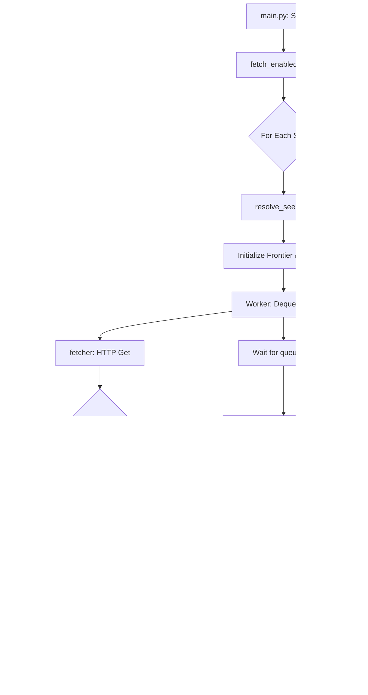

# Web Crawler: Crawl Phase Documentation

This document provides a technical overview of the **Crawl Phase** of the Web Crawler, including the system architecture, process flow, and component-level details.

## 1. Connected Files
The following files within the `baseline-crawler` package are core to the crawl phase:

- **[main.py](file:///home/priti/Web-Crawler/Web_Crawler/baseline-crawler/main.py)**: Entry point. Manages the high-level orchestration, site iteration, and worker initialization.
- **[worker.py](file:///home/priti/Web-Crawler/Web_Crawler/baseline-crawler/crawler/worker.py)**: The backbone of the crawler. Defines the multi-threaded worker logic that executes the fetch-parse-store loop.
- **[fetcher.py](file:///home/priti/Web-Crawler/Web_Crawler/baseline-crawler/crawler/fetcher.py)**: Low-level HTTP communication layer. Handles network requests, retries, and rate-limiting (429) logic.
- **[parser.py](file:///home/priti/Web-Crawler/Web_Crawler/baseline-crawler/crawler/parser.py)**: HTML analysis engine. Extracts URLs and assets, and performs domain/path classification.
- **[frontier.py](file:///home/priti/Web-Crawler/Web_Crawler/baseline-crawler/crawler/frontier.py)**: Management of the URL queue (frontier). Handles synchronization and deduplication.
- **[storage/mysql.py](file:///home/priti/Web-Crawler/Web_Crawler/baseline-crawler/crawler/storage/mysql.py)**: Data persistence layer for MySQL. Handles job status and page metadata storage.

## 2. Crawl Flowchart

## 3. Flow-Wise Breakdown

### Phase 1: Orchestration ([main.py](file:///home/priti/Web-Crawler/Web_Crawler/baseline-crawler/main.py))
1.  **Site Lookup**: Fetches active sites from the `sites` table.
2.  **Seed Resolution**: Verifies the seed URL responds (handling redirects/SSL).
3.  **Job Initialization**: Generates a UUID `job_id` and records the start in the DB.
4.  **Worker Management**: Spawns multiple `Worker` threads and waits for completion using `frontier.queue.join()`.

### Phase 2: Execution ([worker.py](file:///home/priti/Web-Crawler/Web_Crawler/baseline-crawler/crawler/worker.py))
1.  **Looping**: Continuously pulls tasks from the Frontier.
2.  **Pacing**: Applies `CRAWL_DELAY` (if set) to avoid overloading servers.
3.  **Fetching**: Calls the Fetcher to retrieve HTML.
4.  **Storage**: Records the result (status code, size, etc.) in the `crawl_pages` table.
5.  **Post-Processing**: Extracts new links and assets for further crawling.

### Phase 3: Extraction and Filtering ([parser.py](file:///home/priti/Web-Crawler/Web_Crawler/baseline-crawler/crawler/parser.py))
1.  **Regex Classification**: Groups URLs into categories (Assets, Pagination, Media) for filtering.
2.  **Link Resolution**: Converts relative paths to absolute URLs using `urljoin`.
3.  **Malformed Protocol Fix**: Specifically detects and repairs links like `https:domain.com` (missing `//`).
4.  **Safe Filtering**: Blocks non-web protocols (e.g., `mailto:`, `tel:`) and external domains.

## 4. Function-Wise Documentation

| File | Function | Logic & Implementation |
| :--- | :--- | :--- |
| `main.py` | `resolve_seed_url` | Tries URL variants (with/without trailing slash) and returns the final destination after redirects. |
| `worker.py` | `run` | Main thread loop: `dequeue` -> `wait` -> `fetch` -> `store` -> `parse` -> `enqueue`. |
| `fetcher.py` | `fetch` | Executes `requests.get`. Implements exponential backoff: waits `retry_delay` on 429 errors. |
| `parser.py` | `extract_urls` | Uses BeautifulSoup to find `<a>` and asset tags. Applies the **Doubling Fix** for malformed protocols. |
| `frontier.py` | `enqueue` | Normalizes the URL, checks the `visited` set, and thread-safely pushes to the `Queue`. |
| `mysql.py` | `insert_crawl_page` | Uses `INSERT ... ON DUPLICATE KEY UPDATE` to track page visits while avoiding primary key violations. |
