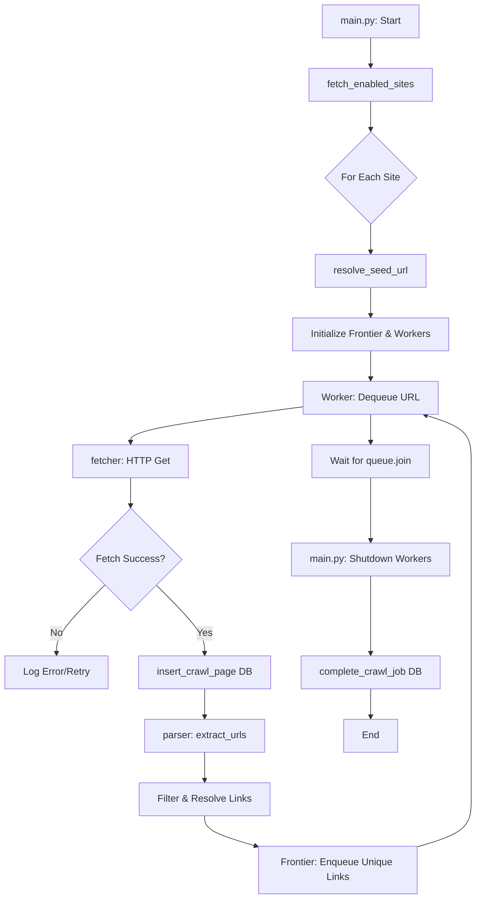

# Web Crawler: Crawl Phase Documentation

This document provides a technical overview of the **Crawl Phase** of the Web Crawler, including the system architecture, process flow, and component-level details.

## 1. Connected Files
The following files within the `baseline-crawler` package are core to the crawl phase:

- **[main.py](file:///home/priti/Web-Crawler/Web_Crawler/baseline-crawler/main.py)**: Entry point. Manages the high-level orchestration, site iteration, and worker initialization.
- **[worker.py](file:///home/priti/Web-Crawler/Web_Crawler/baseline-crawler/crawler/worker.py)**: The backbone of the crawler. Defines the multi-threaded worker logic that executes the fetch-parse-store loop.
- **[fetcher.py](file:///home/priti/Web-Crawler/Web_Crawler/baseline-crawler/crawler/fetcher.py)**: Low-level HTTP communication layer. Handles network requests, retries, and rate-limiting (429) logic.
- **[parser.py](file:///home/priti/Web-Crawler/Web_Crawler/baseline-crawler/crawler/parser.py)**: HTML analysis engine. Extracts URLs and assets, and performs domain/path classification.
- **[frontier.py](file:///home/priti/Web-Crawler/Web_Crawler/baseline-crawler/crawler/frontier.py)**: Management of the URL queue (frontier). Handles synchronization and deduplication.
- **[storage/mysql.py](file:///home/priti/Web-Crawler/Web_Crawler/baseline-crawler/crawler/storage/mysql.py)**: Data persistence layer for MySQL. Handles job status and page metadata storage.

## 2. Crawl Flowchart

## 3. Flow-Wise Breakdown

### Phase 1: Orchestration ([main.py](file:///home/priti/Web-Crawler/Web_Crawler/baseline-crawler/main.py))
1.  **Site Lookup**: Fetches active sites from the `sites` table.
2.  **Seed Resolution**: Verifies the seed URL responds (handling redirects/SSL).
3.  **Job Initialization**: Generates a UUID `job_id` and records the start in the DB.
4.  **Worker Management**: Spawns multiple `Worker` threads and waits for completion using `frontier.queue.join()`.

### Phase 2: Execution ([worker.py](file:///home/priti/Web-Crawler/Web_Crawler/baseline-crawler/crawler/worker.py))
1.  **Looping**: Continuously pulls tasks from the Frontier.
2.  **Pacing**: Applies `CRAWL_DELAY` (if set) to avoid overloading servers.
3.  **Fetching**: Calls the Fetcher to retrieve HTML.
4.  **Storage**: Records the result (status code, size, etc.) in the `crawl_pages` table.
5.  **Post-Processing**: Extracts new links and assets for further crawling.

### Phase 3: Extraction and Filtering ([parser.py](file:///home/priti/Web-Crawler/Web_Crawler/baseline-crawler/crawler/parser.py))
1.  **Regex Classification**: Groups URLs into categories (Assets, Pagination, Media) for filtering.
2.  **Link Resolution**: Converts relative paths to absolute URLs using `urljoin`.
3.  **Malformed Protocol Fix**: Specifically detects and repairs links like `https:domain.com` (missing `//`).
4.  **Safe Filtering**: Blocks non-web protocols (e.g., `mailto:`, `tel:`) and external domains.

## 4. Blocking and Filtering Logic

The crawler implements multi-layered filtering to ensure only relevant, safe, and unique content is processed.

| Component | Phase | Specific Check | Action | Rationale |
| :--- | :--- | :--- | :--- | :--- |
| **[parser.py](file:///home/priti/Web-Crawler/Web_Crawler/baseline-crawler/crawler/parser.py)** | **Extraction** | `_is_allowed_url` | **Block** | Only `http` and `https` protocols are permitted. |
| **[parser.py](file:///home/priti/Web-Crawler/Web_Crawler/baseline-crawler/crawler/parser.py)** | **Extraction** | Domain Matching | **Block** | Netloc must match the seed's registrable domain (e.g., permits `www` vs non-`www`). |
| **[parser.py](file:///home/priti/Web-Crawler/Web_Crawler/baseline-crawler/crawler/parser.py)** | **Extraction** | Fragment Check | **Skip** | Links starting with `#` are internal anchors and are ignored. |
| **[frontier.py](file:///home/priti/Web-Crawler/Web_Crawler/baseline-crawler/crawler/frontier.py)** | **Enqueue** | `should_enqueue` | **Block** | Explicitly excludes `mailto:`, `tel:`, and `javascript:` protocols. |
| **[frontier.py](file:///home/priti/Web-Crawler/Web_Crawler/baseline-crawler/crawler/frontier.py)** | **Enqueue** | Deduplication | **Block** | Checks `visited` and `in_progress` sets to prevent infinite loops. |
| **[fetcher.py](file:///home/priti/Web-Crawler/Web_Crawler/baseline-crawler/crawler/fetcher.py)** | **Fetching** | Content-Type | **Filter** | Only `text/html` and `application/json` are returned; binaries (PDF, JPG, Zip) are logged as ignored. |
| **[worker.py](file:///home/priti/Web-Crawler/Web_Crawler/baseline-crawler/crawler/worker.py)** | **Processing** | Soft Redirect | **Divert** | 404s with Meta-refresh/JS redirection are sent to the JS Renderer instead of being failed. |

## 5. System Parameters and Limits

The following parameters in `config.py` control the crawler's behavior and performance:

| Parameter | Default Value | Description |
| :--- | :--- | :--- |
| `MIN_WORKERS` | 5 | Minimum threads spawned at startup. |
| `MAX_WORKERS` | 50 | Maximum allowed threads for scaling. |
| `REQUEST_TIMEOUT` | 20s | Time before a fetch is considered a "Timeout" error. |
| `CRAWL_DELAY` | 1.0s | Per-worker pause between requests to prevent 429 errors. |
| `ALLOWED_DOMAINS` | `[]` | List of external domains allowed. If empty, restricts to seed domain. |

## 6. Error Handling and Retries ([fetcher.py](file:///home/priti/Web-Crawler/Web_Crawler/baseline-crawler/crawler/fetcher.py))

The system is designed to handle common network challenges and bot detection:

- **HTTP 429 (Rate Limit)**: Triggers **Exponential Backoff**. 
    1. Initial wait: 5s.
    2. Subsequent waits: Double each time (10s, 20s).
    3. Max Retries: 3 per URL.
- **Connection Errors**: Handled with the same retry logic as 429s.
- **Timeouts**: Logged as failures; no automatic retry to avoid hanging workers.
- **Soft Redirects**: Custom logic in `worker.py` detects Meta-refresh or JS redirects on 404 pages and attempts to recover the content via JS rendering.

## 7. Frontier and Queue Management ([frontier.py](file:///home/priti/Web-Crawler/Web_Crawler/baseline-crawler/crawler/frontier.py))

The Frontier manages the "To-Be-Crawled" list:

- **Queue Limit**: The frontier holds a maximum of **10,000 URLs** in memory (`maxsize=10,000`).
- **Deduplication**: Uses a thread-safe `visited` set to ensure no URL is processed twice.
- **Synchronization**: Uses a `threading.Lock` to prevent race conditions during enqueue/dequeue operations across multiple workers.

## 8. Waiting Times and JS Rendering

| Category | Parameter | Value | Description |
| :--- | :--- | :--- | :--- |
| **Network** | `REQUEST_TIMEOUT` | 20s | Max wait for server response. |
| **Pacing** | `CRAWL_DELAY` | 1s | Buffer between worker requests. |
| **JS Load** | `JS_GOTO_TIMEOUT` | 30s | Max wait for Playwright to reach a page. |
| **JS Execution** | `JS_WAIT_TIMEOUT` | 8s | Time spent waiting for JS to execute. |
| **JS Stability** | `JS_STABILITY_TIME`| 5s | Buffer to allow late-loading elements. |

---

## 9. Function-Wise Documentation

| File | Function | Logic & Implementation |
| :--- | :--- | :--- |
| `main.py` | `resolve_seed_url` | Redirect-aware seed validation. |
| `worker.py` | `run` | Core execution loop (Fetch -> Parse -> Store). |
| `fetcher.py` | `fetch` | HTTP Get with Exponential Backoff (5s base). |
| `parser.py` | `extract_urls` | BeautifulSoup extraction with Protocol Doubling fix. |
| `frontier.py` | `enqueue` | Thread-safe deduplication and 10k queue management. |
| `mysql.py` | `insert_crawl_page` | Upsert logic with IST-synchronized timestamps. |
